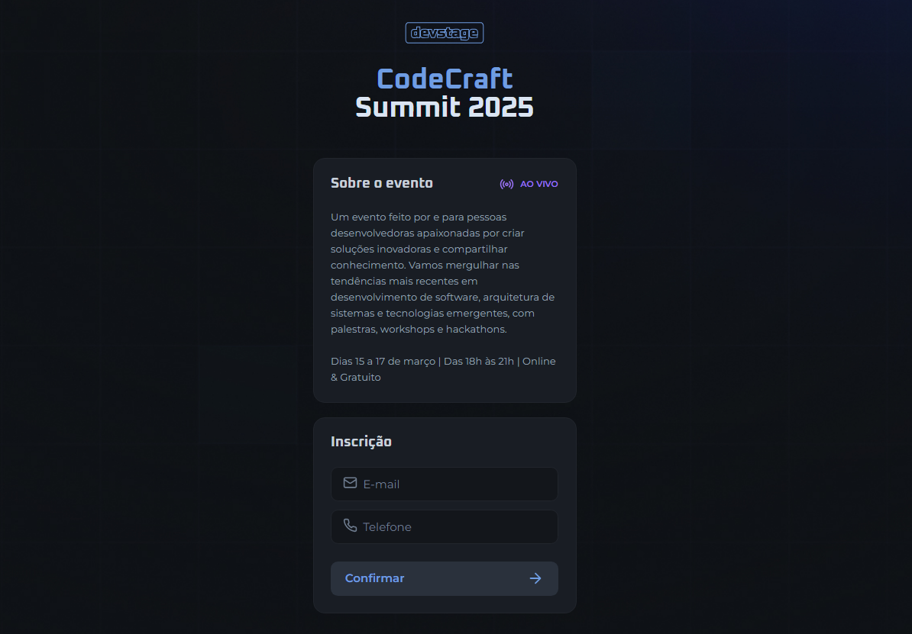

# <NLW/> CONNECT 19 - Dev Stage

Projeto desenvolvido durante o evento gratuito **NLW Connect 19** da Rocketseat.

## Sobre o Projeto

**Dev Stage** é uma página de eventos online e gratuito, voltado para desenvolvedores. O evento, chamado **Code Craft Summit 2025**, permite que os usuários se inscrevam, recebam um link personalizado e convidem outras pessoas para participar.

O projeto foi desenvolvido na **trilha de Full Stack voltada para iniciantes**.

## Tecnologias Utilizadas

- HTML
- CSS
- JavaScript

## Como Usar

1. Clone o repositório:
   ```bash
   git clone https://github.com/Necilia/projeto-devstage.git

2. Abra o arquivo index.html no seu navegador.
   Isso vai abrir a página do evento onde você pode ver as interações e os elementos do projeto.

## Imagem do Projeto

Aqui está um print do projeto para que você veja como ele ficou:




## Licença

    Este projeto é de código aberto e foi desenvolvido como parte do evento **NLW Connect 19** da **Rocketseat**.
    
